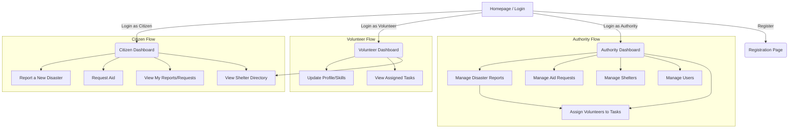

# DRIS Application Navigation Flow

This diagram and description illustrate the user navigation paths for each role (Citizen, Volunteer, Authority) within the DRIS application.

### Navigation Diagram

### Flow Description

1.  **Entry Point:** All users start at the `Homepage`, which provides options to `Login` or `Register`. The registration page will ask for the user's intended role.

2.  **Citizen Flow:**
    *   After logging in, a Citizen lands on their dashboard.
    *   From here, they can navigate to:
        *   A form to **Report a New Disaster**.
        *   A form to **Request Aid**.
        *   A page to view the status of their past **Reports and Requests**.
        *   The public **Shelter Directory**.

3.  **Volunteer Flow:**
    *   After logging in, a Volunteer lands on their dashboard.
    *   Their primary navigation options are:
        *   A page to **Update their Profile**, including skills and availability.
        *   A list of their **Assigned Tasks** from Authorities.
        *   The public **Shelter Directory**.

4.  **Authority Flow:**
    *   After logging in, an Authority is taken to the main **Administrative Dashboard**.
    *   This dashboard is the central hub for all management functions:
        *   **Manage Disaster Reports:** View, filter, and update the status of all reports.
        *   **Manage Aid Requests:** View and track all incoming requests.
        *   **Manage Shelters:** Add, edit, or remove shelters and update their availability.
        *   **Manage Users:** View and manage all user accounts.
        *   **Assign Volunteers:** From the disaster report view, an Authority can assign an available volunteer to a specific task.