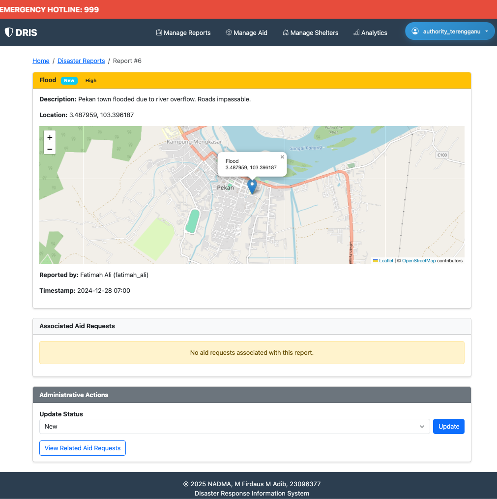

# DRIS System Report

## Overview

The Disaster Response Information System (DRIS) is a web-based platform designed to streamline disaster reporting, aid requests, volunteer coordination, and authority management. The system supports three main user roles: Citizen, Volunteer, and Authority/Admin.

---

## Problem Statement

Malaysia faces frequent natural disasters such as floods, landslides, and haze. Current disaster management methods are fragmented, causing delays in reporting, aid delivery, and volunteer coordination. NADMA requires a centralized system to improve coordination and communication for disaster response.

## Proposed Solution

DRIS is a centralized, web-based platform built with Django. It serves as a single point of contact for citizens, volunteers, and authorities, providing real-time updates on disaster reports and shelter availability. The system is designed to be secure, modular, and user-friendly.

---

## Goals & Objectives

- Streamline disaster event reporting by citizens.
- Efficiently manage and fulfill aid requests.
- Coordinate volunteers based on skills and availability.
- Provide a centralized, up-to-date directory of emergency shelters.
- Empower authorities with a dashboard for monitoring and managing all response activities.

---

## User Personas

- **Citizen:** Members of the public affected by or witnessing a disaster. They report incidents and request aid (food, shelter, rescue).
- **Volunteer:** Individuals who want to help. They register their skills and availability and receive assignments from authorities.
- **Authority:** NADMA staff or authorized personnel. They monitor the situation, manage resources, coordinate shelters, and assign volunteers to tasks.

---

## Key Features

- **Emergency Hotline Banner:** Prominently displays the emergency hotline (999) at the top of every page.
- **Role-Based Navigation:** Dynamic navigation and dashboard content based on user role.
- **Disaster Reporting:** Citizens can submit disaster reports with geolocation via a searchable, draggable map pin.
- **Aid Requests:** Citizens can request aid linked to disaster reports; authorities and volunteers can manage and respond.
- **Shelter Directory:** Public and managed directory of shelters, including location, capacity, and availability.
- **Volunteer Management:** Volunteers can register, update profiles, and be assigned to aid tasks.
- **Analytics Dashboard:** Authorities can view statistics and manage all aspects of disaster response.
- **Responsive UI:** Built with Bootstrap for accessibility and mobile-friendliness.
- **Real-time Updates:** Disaster reports and shelter availability are updated in real time for all users.

---

## Functional Requirements

| Feature                  | Description                                                                 |
|--------------------------|-----------------------------------------------------------------------------|
| User Management          | Role-based registration and login for Citizens, Volunteers, and Authorities |
| Disaster Reporting       | Citizens report disaster events with type, GPS, severity, and timestamp     |
| Aid Request Management   | Citizens submit aid requests (food, shelter, rescue)                        |
| Volunteer Coordination   | Volunteers register skills/availability; authorities assign tasks           |
| Shelter Directory        | Public list of shelters with location, capacity, and availability           |
| Administrative Dashboard | Authorities manage users, reports, shelters, and assignments                |

---

## Non-Functional Requirements

| Requirement    | Description                                                         |
|----------------|---------------------------------------------------------------------|
| Architecture   | Follows Django's Model-View-Template (MVT) architecture             |
| Security       | Secure authentication and role-based access control (RBAC)          |
| Code Quality   | Modular, maintainable, and reusable codebase                        |
| Real-time      | Real-time updates for disaster reports and shelter availability     |

---

## Technical Stack

- **Framework:** Django
- **Frontend:** Django templates, Bootstrap, Leaflet.js for maps
- **Database:** SQLite3 (for prototype)
- **Architecture:** Model-View-Template (MVT)
- **Admin:** Django-admin for backend management

---

## Recent Enhancements

- Emergency hotline banner with marquee effect.
- NADMA logo and blended background image in the hero section.
- Disaster report submission with map search and draggable pin, integrated in the form card.

---

## System Structure

- **Backend:** Django (Python)
- **Frontend:** Django templates, Bootstrap, Leaflet.js for maps
- **Static Assets:** Located in `staticfiles/`
- **Documentation:** All docs in `docs/`

---

# Data Model Design

This section outlines the minimal data model for the DRIS prototype application.

## Entity Relationship Summary

* **User:** A custom User model with a `role` field to distinguish between Citizens, Volunteers, and Authorities.
* **DisasterReport:** A citizen can create disaster reports with location and severity.
* **AidRequest:** A citizen can make aid requests linked to disaster reports.
* **Shelter:** A standalone entity for managing available shelter resources.

## Tables (Models)

### 1. User
*(Extends Django's AbstractUser)*

| Field Name | Data Type | Description/Constraints |
| :--- | :--- | :--- |
| `id` | `BigAutoField` | Primary Key |
| `username` | `CharField` | Unique, for login |
| `password` | `CharField` | Hashed by Django |
| `role` | `CharField` | Choices: 'CITIZEN', 'VOLUNTEER', 'AUTHORITY' |

### 2. DisasterReport

| Field Name | Data Type | Description/Constraints |
| :--- | :--- | :--- |
| `id` | `BigAutoField` | Primary Key |
| `reporter` | `ForeignKey(User)` | The citizen who reported it |
| `disaster_type` | `CharField` | Choices: 'Flood', 'Landslide', 'Haze', 'Other' |
| `latitude` | `DecimalField` | GPS coordinate |
| `longitude` | `DecimalField` | GPS coordinate |
| `severity` | `CharField` | Choices: 'Low', 'Medium', 'High' |
| `timestamp` | `DateTimeField` | Auto-generated on creation |

### 3. AidRequest

| Field Name | Data Type | Description/Constraints |
| :--- | :--- | :--- |
| `id` | `BigAutoField` | Primary Key |
| `requester` | `ForeignKey(User)` | The citizen requesting aid |
| `disaster_report` | `ForeignKey(DisasterReport)` | Optional link to a disaster report |
| `aid_type` | `CharField` | Choices: 'Food', 'Shelter', 'Rescue' |
| `status` | `CharField` | Choices: 'Pending', 'Fulfilled' |

### 4. Shelter

| Field Name | Data Type | Description/Constraints |
| :--- | :--- | :--- |
| `id` | `BigAutoField` | Primary Key |
| `location` | `CharField` | Address or description |
| `capacity` | `IntegerField` | Maximum number of people |
| `availability` | `IntegerField` | Current available spots |

## Relationships

* User (1) --- (M) DisasterReport: A user can create multiple disaster reports
* User (1) --- (M) AidRequest: A user can make multiple aid requests
* DisasterReport (1) --- (M) AidRequest: A disaster report can have multiple aid requests
* Shelter is standalone, referenced in AidRequest if needed

---

# Navigation Flow

This section illustrates the user navigation paths for each role (Citizen, Volunteer, Authority) within the DRIS application.

## Navigation Diagram


## Flow Description

1. **Entry Point:** All users start at the `Homepage`, which provides options to `Login` or `Register`. The registration page will ask for the user's intended role.

2. **Citizen Flow:**
   * After logging in, a Citizen lands on their dashboard.
   * From here, they can navigate to:
     * A form to **Report a New Disaster**.
     * A form to **Request Aid**.
     * A page to view the status of their past **Reports and Requests**.
     * The public **Shelter Directory**.

3. **Volunteer Flow:**
   * After logging in, a Volunteer lands on their dashboard.
   * Their primary navigation options are:
     * A page to **Update their Profile**, including skills and availability.
     * A list of their **Assigned Tasks** from Authorities.
     * The public **Shelter Directory**.

4. **Authority Flow:**
   * After logging in, an Authority is taken to the main **Administrative Dashboard**.
   * This dashboard is the central hub for all management functions:
     * **Manage Disaster Reports:** View, filter, and update the status of all reports.
     * **Manage Aid Requests:** View and track all incoming requests.
     * **Manage Shelters:** Add, edit, or remove shelters and update their availability.
     * **Manage Users:** View and manage all user accounts.
     * **Assign Volunteers:** From the disaster report view, an Authority can assign an available volunteer to a specific task.

## Main Navigation Structure

```
[Home] [Disaster Reports] [Aid Requests] [Shelters] [Analytics] [Login/Register or Profile/Logout]
```
- Navigation links are shown/hidden based on user role and authentication status.

## Page Access Matrix

| Page                | Citizen | Volunteer | Authority/Admin |
|---------------------|:-------:|:---------:|:--------------:|
| Home                |   ✔     |    ✔      |      ✔         |
| Disaster Reports    |   ✔     |    ✔      |      ✔         |
| Aid Requests        |   ✔     |    ✔      |      ✔         |
| Shelters            |   ✔     |    ✔      |      ✔         |
| Analytics           |         |           |      ✔         |
| Volunteer Register  |         |    ✔      |                |
| Manage Shelters     |         |           |      ✔         |
| Assign Tasks        |         |           |      ✔         |

## User Journey Examples

### Citizen
- **Report Disaster:** Home → Report Disaster → Fill Form → Submit → See My Reports
- **Request Aid:** Home → Request Aid → Fill Form → Submit → See My Requests

### Volunteer
- **Respond to Aid:** Home → Aid Requests → View Details → Respond/Update Status
- **Register as Volunteer:** Home → Volunteer Profile → Register/Update

### Authority/Admin
- **Assign Task:** Home → Manage Aid → Aid Request Detail → Assign Volunteer
- **View Analytics:** Home → Analytics → Dashboard

---

# UI/UX Design

This section describes the layout and structure for key templates in the DRIS web application.

## Base Template Structure

The base template provides a consistent structure for all pages in the application.

### Layout & Structure:

* **Header:** Contains the NADMA logo on the left and an emergency hotline (999) on the right.
* **Navigation Bar:** A simple navigation bar with links that change based on user role (e.g., Login/Register, Dashboard, Report Disaster).
* **Main Content:** A block that will be populated by child templates.
* **Footer:** A sticky footer containing the copyright notice, your name, and student ID.

### Code Structure:
```html
<!DOCTYPE html>
<html lang="en">
<head>
    <meta charset="UTF-8">
    <title>DRIS</title>
    <!-- Link to CSS framework like Bootstrap -->
</head>
<body>
    <header style="display: flex; justify-content: space-between; padding: 10px; border-bottom: 1px solid #ccc;">
        <div><!-- NADMA Logo Image --> NADMA</div>
        <div>Emergency Hotline: <strong>999</strong></div>
    </header>

    <nav>
        <!-- Navigation links here -->
    </nav>

    <main class="container">
        
        <!-- Page-specific content will go here -->
        
    </main>

    <footer style="text-align: center; padding: 10px; margin-top: 20px; border-top: 1px solid #ccc;">
        <p>&copy; 2025 NADMA, [Your Full Name], [Your Student ID]</p>
    </footer>
</body>
</html>
```

## Key Page Templates

### Template for Viewing and Filtering Disaster Reports

* **Purpose:** To allow all users (especially Authorities) to view a list of all submitted disaster reports and filter them to find relevant information quickly.
* **Design:**
  * **Filters:** A form at the top of the page with dropdowns for `Disaster Type` and `Severity`, and a text input for `Location`. A "Filter" button applies the search.
  * **Report List:** The reports are displayed in a table or as a series of cards. Each entry shows key information: Type, Location (GPS), Severity, Status, and Timestamp.
  * **Actions:** For Authority users, each report will have a "Details" button to view more information and manage assignments.

### Template for Submitting Aid Requests OR Registering as a Volunteer

* **Purpose:** To provide a simple form for a specific user action.
* **Design (Aid Request Form for Citizens):**
  * A clean, single-column form.
  * **Fields:**
    * Dropdown for `Aid Type` (Food, Shelter, Rescue, Medical).
    * A `textarea` for `Description` to provide more details.
    * A `Submit Request` button.
  * The form will be pre-filled with the user's identity on the backend.
* **Design (Volunteer Registration/Profile Form for Volunteers):**
  * A form to capture or update volunteer-specific information.
  * **Fields:**
    * A `textarea` or tag-input field for `Skills` (e.g., "First Aid, Driving, Communication").
    * A checkbox for `Availability` ("I am currently available to help").
    * An `Update Profile` button.

## UI/UX Design Principles

### Overview

The Disaster Response Information System (DRIS) is designed for three main user roles:
- **Citizen**: Report disasters, request aid, view their own reports/requests.
- **Volunteer**: View/respond to aid requests, manage their volunteer profile.
- **Authority/Admin**: Manage disaster reports, aid requests, volunteers, shelters, and view analytics.

The UI is built with Bootstrap for a modern, responsive, and accessible experience.

### Base Template Components

- **Navbar**: Dynamic links based on user role (Home, Manage Reports, Manage Aid, Manage Shelters, Analytics, Login/Logout, Register).
- **Hero Section**: Full-width welcome and role-based intro.
- **Quick Actions**: Cards for key actions (e.g., Report Disaster, Request Aid, Manage Shelters).
- **Footer**: Credits and copyright.

### Key Pages

#### Home
- Role-based quick actions and navigation.
- Welcome hero.

#### Disaster Reports
- List, filter, and detail views.
- Submit report (citizen).
- Manage/verify (authority/admin).

#### Aid Requests
- List, filter, and detail views.
- Submit request (citizen).
- Assign/respond (volunteer, authority).

#### Volunteer Registration/Profile
- Registration form.
- Profile management.

#### Authority Analytics
- Dashboard cards and charts for disaster, aid, assignment stats.

#### Shelter Directory
- Public list with location, capacity, availability.
- Filtering by location and availability.
- Add/edit (authority/admin).

#### Authentication
- Login, registration, logout.

### UI/UX Principles

- **Consistency**: Bootstrap components, color scheme, and spacing.
- **Accessibility**: ARIA labels, proper form labels, keyboard navigation.
- **Responsiveness**: Mobile-friendly layouts.
- **Feedback**: Success/error messages, alerts, and badges.

### Color Palette

- Primary: #3498db (blue)
- Secondary: #2c3e50 (dark blue)
- Success: #28a745 (green)
- Danger: #dc3545 (red)
- Info: #17a2b8 (teal)
- Light: #f8f9fa
- Dark: #343a40

### Typography

- Headings: Bold, clear, Bootstrap defaults.
- Body: Readable, sufficient contrast.

### Accessibility

- All forms have labels.
- Buttons and badges have ARIA labels.
- Alerts use `role="alert"`.
- Sufficient color contrast.

---

## System Screenshots

### Registration and Profile

**Registration Page**

The registration page allows new users to create an account by providing essential details. The process is streamlined to ensure quick access for citizens, volunteers, and authorities.

**Role Selection During Registration**

During registration, users select their intended role (Citizen, Volunteer, Authority), which tailors their experience and access within the system.

**Profile Dropdown**

The profile dropdown menu provides users with quick access to their account settings and logout functionality, ensuring secure and convenient session management.

---

### Authority/Admin Views

**Homepage for Authority**

The authority dashboard serves as the central hub for disaster management, providing real-time updates and direct access to disaster reports, aid requests, shelters, and analytics.

**Disaster Report List and Detail**

Authorities can view and filter all submitted disaster reports. Each report entry includes disaster type, location, severity, and status, with interactive map previews for spatial context.


Detailed view of a specific disaster report. Authorities can inspect the report's information, view the precise location on an interactive map, and take management actions as needed.

**Aid Requests List and Detail**

Authorities can monitor, filter, and process all incoming aid requests, ensuring timely and effective disaster response.


Each aid request detail page provides comprehensive information, including requester, type of aid, and status, with options to assign volunteers or update fulfillment status.

**Shelter Directory and Management**

A comprehensive directory of available shelters, displaying location, capacity, and current availability. Authorities can quickly assess and manage shelter resources.


Authorities can edit shelter details, update capacity, and manage availability to ensure optimal resource allocation during disasters.


The shelter directory supports advanced filtering, allowing authorities to efficiently locate and manage shelters based on specific criteria.

**Analytics Dashboard**

The analytics dashboard provides visual insights into disaster trends, aid requests, and resource allocation, supporting data-driven decision-making for authorities.

---

### Citizen Views

**Disaster Reports List and Detail**

Citizens can view a list of their submitted disaster reports, each with status indicators and interactive map previews for easy tracking and spatial awareness.


Each disaster report detail page features an interactive map, allowing citizens to review the exact location of the reported incident and all associated details.

**Submit Disaster Report**

The disaster report submission form enables citizens to report incidents efficiently. The form includes fields for disaster type, severity, and description.


During disaster reporting, citizens can search for a location and precisely place a pin on the interactive map by dragging and dropping, ensuring accurate geolocation of the incident.

**Aid Requests**

Citizens can submit aid requests specifying the type of assistance needed. The process is integrated with disaster reports for seamless support.


Citizens can view the status and details of their submitted aid requests, including fulfillment progress and any authority or volunteer responses.

---

### Volunteer Views

**Volunteer Homepage**

The volunteer dashboard provides an overview of assigned tasks and quick access to disaster and aid management features.

**Disaster Reports and Aid Requests**

Volunteers can view disaster reports relevant to their assignments, with interactive map integration for situational awareness.


A list of aid requests available for volunteers to respond to, with filtering and sorting options for efficient task management.


Volunteers can view detailed information about aid requests and take direct action, such as accepting assignments or updating status.