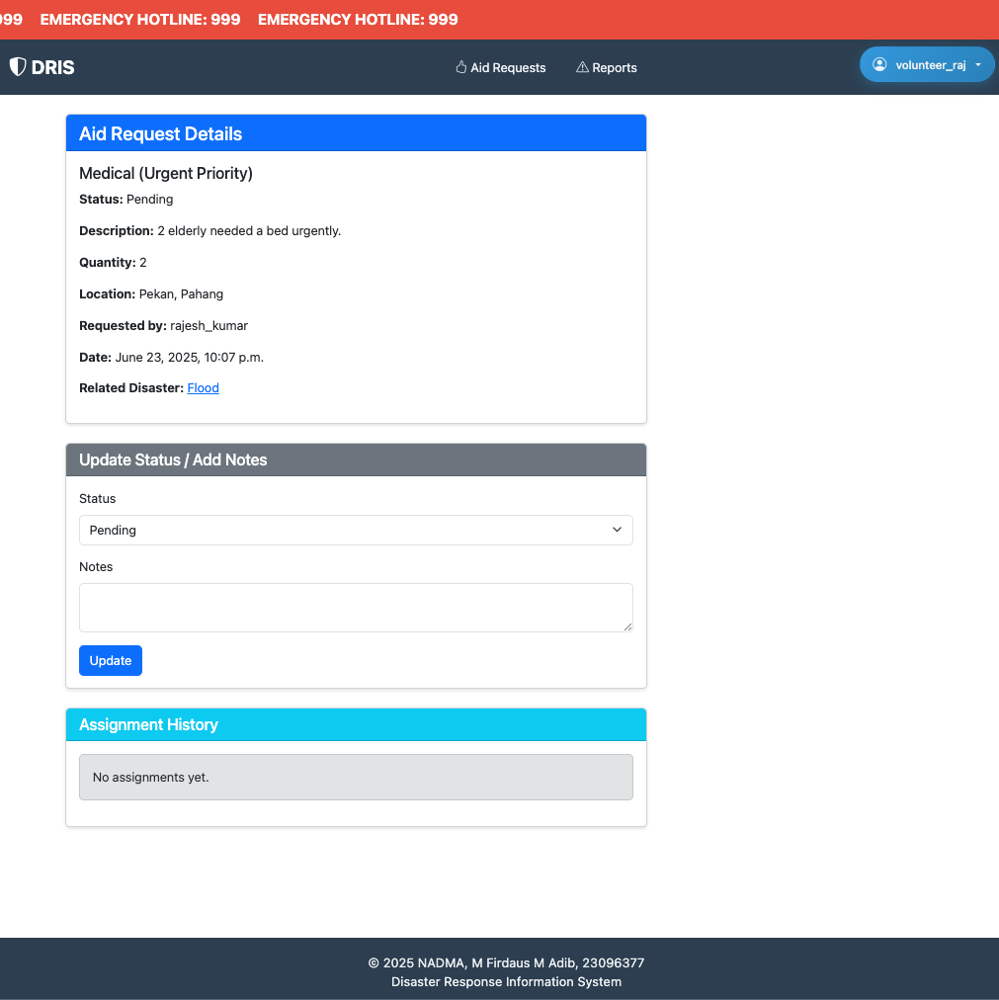

# DRIS System Report

## Overview

The Disaster Response Information System (DRIS) is a web-based platform designed to streamline disaster reporting, aid requests, volunteer coordination, and authority management. The system supports three main user roles: Citizen, Volunteer, and Authority/Admin.

## Key Features

- **Emergency Hotline Banner:** Prominently displays the emergency hotline (999) at the top of every page.
- **Role-Based Navigation:** Dynamic navigation and dashboard content based on user role.
- **Disaster Reporting:** Citizens can submit disaster reports with geolocation via a searchable, draggable map pin.
- **Aid Requests:** Citizens can request aid linked to disaster reports; authorities and volunteers can manage and respond.
- **Shelter Directory:** Public and managed directory of shelters, including capacity and availability.
- **Volunteer Management:** Volunteers can register, update profiles, and be assigned to aid tasks.
- **Analytics Dashboard:** Authorities can view statistics and manage all aspects of disaster response.
- **Responsive UI:** Built with Bootstrap for accessibility and mobile-friendliness.

## Documentation

- [Data Model](Data_model.md): Entity relationships and database schema.
- [Navigation Flow](Navigation_Flow.md): User journeys, navigation diagrams, and access matrix.
- [UI/UX Design](UI_UX_design.md): Template structure, wireframes, and design principles.

## Recent Enhancements

- Emergency hotline banner with marquee effect.
- NADMA logo and blended background image in the hero section.
- Disaster report submission with map search and draggable pin, integrated in the form card.

## System Structure

- **Backend:** Django (Python)
- **Frontend:** Django templates, Bootstrap, Leaflet.js for maps
- **Static Assets:** Located in `staticfiles/`
- **Documentation:** All docs in [`docs/`](docs/)

---

For detailed data models, navigation, and UI/UX, see the linked documentation files above.

---

## System Screenshots

### Authority/Admin Views

**Homepage for Authority**

The authority dashboard provides quick access to disaster management, aid requests, shelters, and analytics.

**Disaster Report List and Detail**

Authorities can view, filter, and manage all submitted disaster reports.

Detailed view of a specific disaster report, including location and status.

**Aid Requests List and Detail**

Authorities can monitor and process all incoming aid requests.

Detailed information for each aid request, with options to assign volunteers or update status.

**Shelter Directory and Management**

A directory of available shelters, showing capacity and availability.

Authorities can edit shelter details and manage resources.

Shelter directory supports filtering for efficient management.

**Analytics Dashboard**

Visual analytics provide insights into disaster reports, aid requests, and resource allocation.

---

### Citizen Views

**Disaster Reports List and Detail**

Citizens can view their submitted disaster reports and track statuses.

Detailed view of a citizen's disaster report, including map location.

**Submit Disaster Report**

Form for citizens to submit new disaster reports.

Citizens can search and drop a pin on the map to specify the disaster location.

**Aid Requests**

Citizens can request aid directly from the system.

Citizens can view the status and details of their aid requests.

---

### Volunteer Views

**Volunteer Homepage**

Volunteers see a dashboard with tasks and quick access to disaster and aid management.

**Disaster Reports and Aid Requests**

Volunteers can view disaster reports relevant to their assignments.

A list of aid requests available for volunteers to respond to.

Volunteers can view details and take action on aid requests.

---

### Registration and Profile

**Registration Page**

New users can register for the system, providing necessary details.

**Role Selection During Registration**

Users select their intended role (Citizen, Volunteer, Authority) during registration.

**Profile Dropdown**

The profile dropdown provides quick access to user settings and logout.